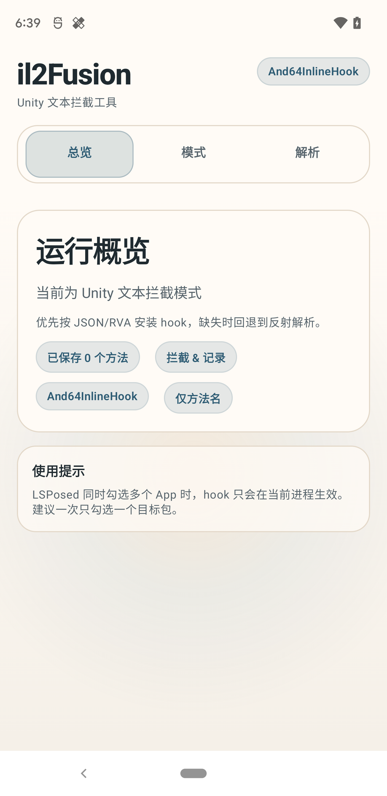
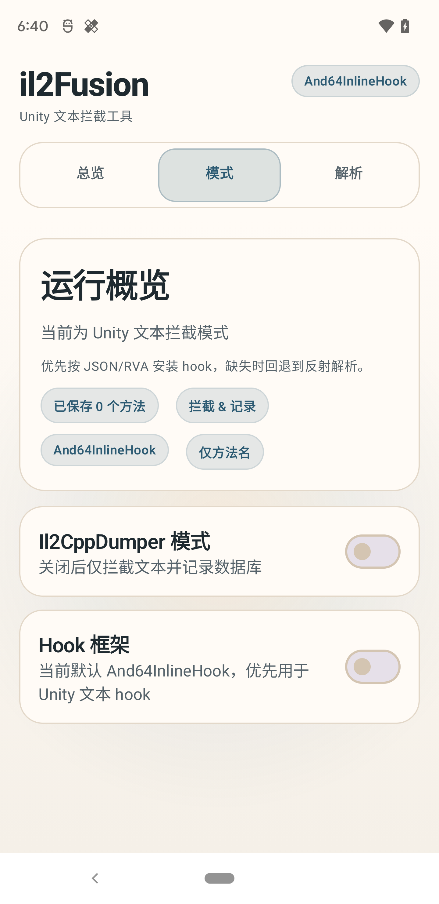
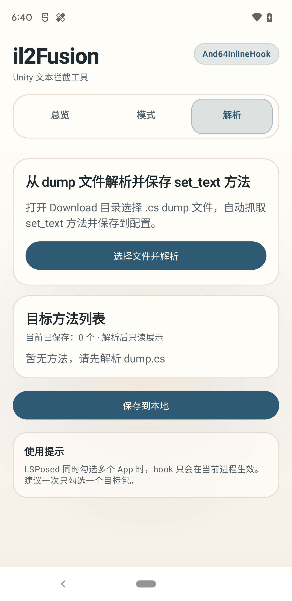

il2Fusion
================

  

LSPosed（Java 层 hook）+ And64InlineHook / Dobby（Native 层 hook）+ ContentProvider 跨进程通信的 Il2Cpp 工具链项目。

English version: see [README_EN](doc/README_EN.md).

  
  
  

## 功能特性
- 双 Hook 后端：新增 `And64InlineHook` 支持，并保留 `Dobby` 作为可切换后端；当前默认优先 `And64InlineHook`。
- Dump 模式优先：一键触发 Il2CppDumper 生成 `dump.cs`，自动尝试复制到 `/sdcard/Download/<pkg>.cs` 并 Toast 结果。
- Unity 文本拦截/替换：在 `libil2cpp.so` 中按目标方法安装 hook，优先消费 JSON/RVA 配置，缺失时回退到反射解析；支持文本记录与翻译替换链路。
- 配置同步：插件 App 写入 `ContentProvider (com.tools.il2fusion.provider/config)`，注入进程读取后下发到 native。
- 文件解析：可从 `.cs` dump 文件自动解析 `set_text` 上方的方法全名，并生成 JSON 供导入。
- UI 重构：界面已重构为新的 Compose 工具界面，提供更清晰的模式切换、Hook 框架切换和配置展示。

## 环境要求
- 已 Root 的设备，Magisk + LSPosed 环境。
- Android 12+（minSdk 31，targetSdk 35，compileSdk 36）。
- 默认 ABI：`arm64-v8a`（如需其他 ABI，请补齐 `app/src/main/cpp/libs/<abi>/libdobby.a` 并调整 `ndk.abiFilters`）。
- 已验证设备：
  - Google Pixel 3 XL，Android 12（SP1A.210812.016.C2 / 8618562）。
  - MacOS、Windows 端 MuMu Android 12 模拟器

## 快速开始
1) 构建模块：`./gradlew :app:assembleDebug`（包含 CMake，生成 `libnative_hook.so`）。  
2) 安装并在 LSPosed 勾选目标应用（仅一个）。  
3) 打开插件 App：  
   - 关闭 Dump 开关即为“文本拦截”模式，解析 dump.cs 自动获取 `Namespace.Class.set_text` 列表（无需手填，解析后自动保存）。  
   - Hook 框架默认使用 `And64InlineHook`，也可以在界面中切换为 `Dobby Hook`。
   - 开启 Dump 开关进入 Dump 模式，启动目标应用后会自动生成 `dump.cs` 并尝试复制到 Download。  
4) 启动目标应用验证：  
   - 文本拦截模式：等待 `libil2cpp.so` 后安装 hook，logcat 标签 `[il2Fusion]`，文本存储于 `/data/data/<pkg>/text.db`。
   - Dump 模式：等待 `libil2cpp.so` 后自动 dump，并 Toast 提示复制结果。  

## 架构与目录
- LSPosed 入口：`app/src/main/java/com/tools/module/MainHook.kt`（`assets/xposed_init` 指定），在 `Application.attach` 后加载 `libnative_hook.so` 并调用 JNI。
- 配置与仓库：`app/src/main/java/com/tools/il2fusion/config/`，通过 `ContentProvider` 同步 Dump 开关、Hook 后端、目标方法和 JSON 配置。
- Compose UI：`app/src/main/java/com/tools/il2fusion/ui/`，包含重构后的工具化界面、模式切换和文件解析逻辑。
- Native Hook：`app/src/main/cpp/native_hook.cpp` 等，等待 `libil2cpp.so`，支持 `And64InlineHook` / `Dobby` 双后端并写入 SQLite。
- Il2CppDumper：`app/src/main/cpp/il2CppDumper/`，Dump 完成后尝试复制到 Download。
- JSON / 翻译存储：`app/src/main/cpp/config/` 与 `app/src/main/cpp/plugins/textExtractor/`，负责 JSON 提取、Unity 文本查找和替换逻辑。
- 资源声明：`app/src/main/assets/xposed/`（模块描述、入口配置）。

## 第三方致谢
- [Rprop - And64InlineHook](https://github.com/Rprop/And64InlineHook)：ARM64 Inline Hook 实现。
- [jmpews - Dobby](https://github.com/jmpews/Dobby)：轻量级跨平台 hook 框架。
- [Perfare - Zygisk-Il2CppDumper](https://github.com/Perfare/Zygisk-Il2CppDumper)：Il2CppDumper 实现参考。

## 贡献与反馈
- 欢迎提交 issue 与 feature 请求，描述清楚环境、目标 App 和期望行为。
- 也欢迎 PR 修复 bug、完善多 ABI 支持或改进 UI/交互。  

## 免责声明
- 本项目仅供学习、研究与安全测试之用，不得用于任何违法、侵权或商业牟利场景。
- 使用者需自行确保遵守所在地法律法规，对由此产生的全部后果自行承担。
