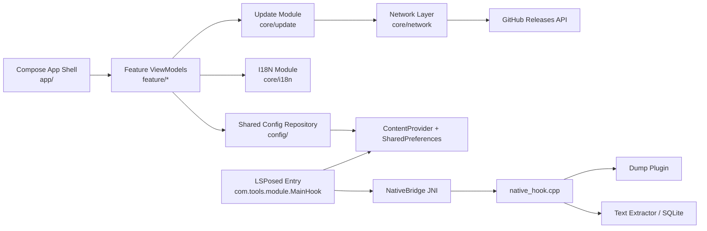
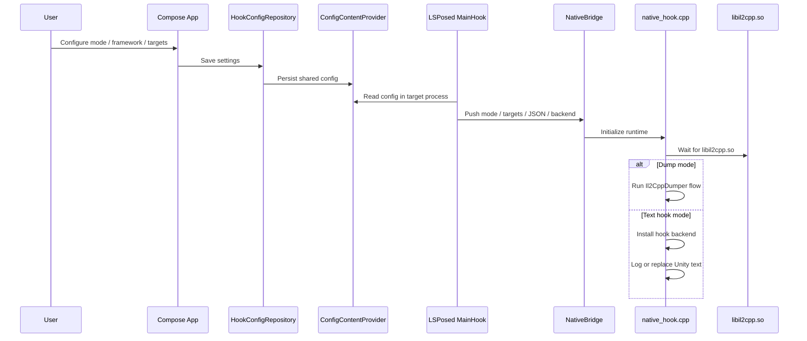

il2Fusion
================

  

il2Fusion is an Android-side Unity game reverse engineering toolkit built around LSPosed, JNI, and native hook backends. It combines Il2Cpp dump generation, configurable text interception, cross-process configuration sync, and on-device tooling for reverse engineering workflows.

Chinese version: see [README](../README.md).

## Highlights
- Dual native hook backends with runtime selection: `And64InlineHook` by default, `Dobby` as an alternative.
- Dump-first workflow that generates `dump.cs` and exports it to `/sdcard/Download/<pkg>.cs`.
- Unity text interception pipeline with JSON/RVA preference and reflection fallback.
- Cross-process config sync from the app process to the LSPosed-injected target process.

## Architecture Overview

## How It Works

## Feature Set
- **Dump workflow:** trigger Il2Cpp dump generation and export the result to the device download directory.
- **Text interception:** install native hooks against Unity text setters and store captured text in SQLite.
- **Parser flow:** extract `set_text` targets from `dump.cs` and persist them as method names plus JSON metadata.

## Requirements
- Rooted device with Magisk + LSPosed.
- Android 12+ (`minSdk 31`, `targetSdk 35`, `compileSdk 36`).
- Default ABI: `arm64-v8a`.
  For additional ABIs, add `app/src/main/cpp/libs/<abi>/libdobby.a` and update `ndk.abiFilters`.
- Verified device: Google Pixel 3 XL, Android 12 (`SP1A.210812.016.C2 / 8618562`).

## Quick Start
1. Build the module: `./gradlew :app:assembleDebug`
2. Install the APK and enable the module in LSPosed for a single target app.
3. Open the il2Fusion app and choose one workflow.
   Text hook mode:
   Leave Dump disabled, parse `dump.cs`, and persist the target setter list.
   Dump mode:
   Enable Dump mode, launch the target app, and wait for `dump.cs` export.
4. Validate runtime behavior in the target app.
   Text hook mode:
   Wait for `libil2cpp.so`, confirm hooks are installed, and inspect `/data/data/<pkg>/text.db`.
   Dump mode:
   Wait for the dump flow and check the generated file in the Download directory.

## Project Layout
- `app/src/main/java/com/tools/il2fusion/app/`: app shell, navigation, startup update check, and global dialogs.
- `app/src/main/java/com/tools/il2fusion/feature/`: page-level MVVM features for overview, mode, parse, and settings.
- `app/src/main/java/com/tools/il2fusion/core/`: shared modules for design components, i18n, network, and update flow.
- `app/src/main/java/com/tools/il2fusion/config/`: provider-backed shared configuration used by both app and hook process.
- `app/src/main/java/com/tools/module/`: LSPosed entry and JNI-facing Android bridge.
- `app/src/main/cpp/`: native hook runtime, Il2Cpp dumper integration, text extractor plugins, and SQLite support.
- `app/src/main/assets/xposed/`: LSPosed descriptors and module entry declaration.

## Credits
- [Rprop - And64InlineHook](https://github.com/Rprop/And64InlineHook): ARM64 inline hook implementation.
- [jmpews - Dobby](https://github.com/jmpews/Dobby): lightweight cross-platform hook framework.
- [Perfare - Zygisk-Il2CppDumper](https://github.com/Perfare/Zygisk-Il2CppDumper): Il2CppDumper implementation reference.

## Contributing
- Issues and feature requests are welcome. Include target app, Android version, LSPosed environment, expected behavior, and logs when possible.
- PRs that improve hook stability, parser accuracy, ABI coverage, documentation, or UI/UX are welcome.

## Disclaimer
- For learning, research, and security testing only. Do not use for illegal, infringing, or commercial purposes.
- Users must comply with local laws and bear all responsibilities arising from usage.
